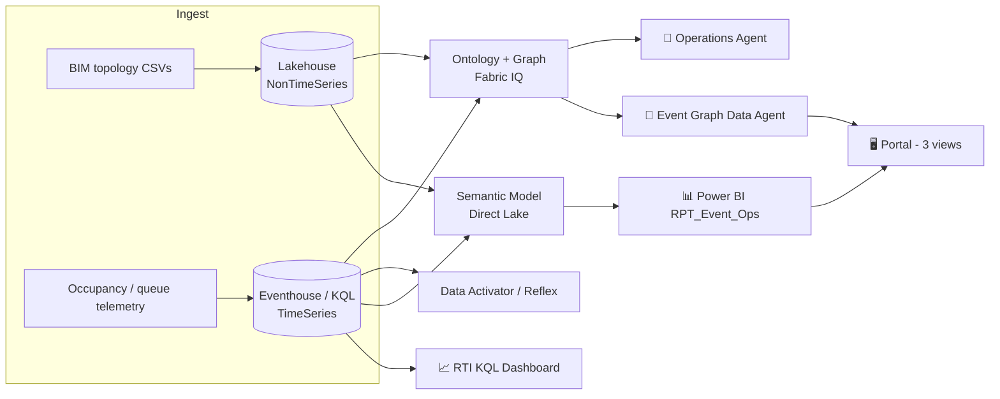

<div align="center">

# ⚡ Live Event Operations

### Real-time event operations on **Microsoft Fabric** — one ontology, autonomous + interactive agents, and a persona-driven portal.


*A data-first reference for **large-scale conference** live events — sharing the same RTI reference architecture, applied to the event domain.*

</div>

---

## ✨ What it is

A single **Fabric IQ ontology** unifies **static topology** (BIM zones, access gates, sessions, sponsors) with **live telemetry** (occupancy, crowd density, queue wait-time). It is consumed by three surfaces:

| Surface | Role |
|---|---|
| 🤖 **Operations Agent** | Autonomous, real-time detection over the Eventhouse — gate congestion, zone saturation, crowd density, comfort — with recommended remediation. |
| 💬 **Event Graph Data Agent** | Interactive natural-language Q&A over the ontology (root-cause + VIP-sponsor impact) via **GQL / KQL**. |
| 📊 **RTI Dashboard + Power BI report** | Real-time views: KQL dashboard (30 s refresh) + `RPT_Event_Ops` (4 pages). |

All of it is wrapped in a **web portal** (FastAPI) with **3 business views** — see [🖥️ The portal](#️-the-portal).

---

## 🎬 The storyline — pilot `AMGFL26`

> Access gate **GATE-05** (serving **Salle Aspen**) hits a **congestion peak** — security queue ≈ **25 min**.
> Aspen **saturates** during the flagship sessions *AI for Good / Beauty & AI / Smart City 2030* → **3 VIP sponsors at risk** (Northwind Tech, Lumiere Beauty, City of Aurora).

It answers the brief's two demo questions:

- 🟢 *Was the "AI for Good" session's room full?* → **yes**, occupancy saturated.
- 🟢 *When and where was the security wait-time highest?* → **GATE-05 at peak**.

---

## 🏗️ Architecture



- **Topology → Lakehouse** (NonTimeSeries) · **Telemetry → Eventhouse/KQL** (TimeSeries).
- Both are bound into one **Ontology + Graph** (Fabric IQ) → multi-hop RCA + sponsor impact.
- Full design: [`docs/ARCHITECTURE.md`](docs/ARCHITECTURE.md).

---

## 🚀 Quick start

```powershell
# 1. Config — then fill in YOUR capacity_id and tenant_id (nothing is pre-filled: this repo is public)
copy src\config.example.yaml src\config.yaml

# 2. ✅ Mandatory test gate — never deploy on red
python -m pytest tests/ -v --tb=short          # 38/38 offline

# 3. Deploy everything (idempotent — generates data, then ends with a warm-up)
python src\deploy_all.py

# 4. Launch the portal → http://localhost:8000
.\portal\start.ps1
```

> The portal resolves every Fabric ID from `src/state.json` (written by the deploy pipeline) or from
> `WORKSPACE_ID` / `REPORT_ID` / `DATASET_ID` / `DATA_AGENT_ID` / `DASHBOARD_ID` env vars. There is no
> hardcoded fallback — a missing ID fails fast with an explicit error. The optional Real-Time embed
> needs your own Entra app registration, supplied via `FABRIC_EMBED_CLIENT_ID` / `FABRIC_EMBED_TENANT_ID`.

Useful flags:

```powershell
python src\deploy_all.py --from ontology       # resume from a step
python src\deploy_all.py ontology graph         # run only these steps
python src\deploy_all.py --skip data_activator,kql_dashboard
python src\deploy_all.py --warmup               # warm-up only, no deploy (before a demo)
python src\deploy_all.py --no-warmup            # deploy without the trailing warm-up
python src\refresh_graph.py                     # re-ingest the graph after topology changes
```

---

## 🧱 Deploy pipeline (`deploy_all.py`, canonical order)

Each step is **idempotent** (state tracked in `src/state.json`):

| # | Step | Artifact |
|--:|---|---|
| 1 | `generate_data` | Synthetic `AMGFL26` topology + telemetry CSVs |
| 2 | `workspace` | Fabric workspace on capacity |
| 3 | `lakehouse` | Topology Delta tables (Edition, Zone, Gate, Sensor, Session, Customer, Sponsorship, Observation) |
| 4 | `setup_notebook` | CSV → Delta conversion |
| 5 | `eventhouse` | KQL tables (telemetry_kpi, telemetry_queue, alarms, event_logs) |
| 6 | `preload_telemetry` | Historical telemetry ingest (retries the transient Kusto 520) |
| 7 | `ontology` | NonTimeSeries + TimeSeries bindings |
| 8 | `graph` | Graph definition + `RefreshGraph` |
| 9 | `kql_dashboard` | RTI dashboard (4 persona pages) |
| 10 | `data_activator` | Reflex threshold alerting |
| 11 | `operations_agent` | Autonomous detection agent |
| 12 | `kql_shortcuts` | OneLake availability for KQL |
| 13 | `semantic_model` | Direct Lake model (topology + telemetry) |
| 14 | `data_agent` | Event Graph Data Agent (NL → GQL/KQL) |
| 15 | `report` | Power BI `RPT_Event_Ops` (4 pages) |

---

## 🖥️ The portal

`portal/` — a FastAPI app (`http://localhost:8000`) that embeds the report + a chat agent, organized in **3 business views** (decoupled from the report page / data-agent internals):

| View | Focus | Embedded pages | Agent greeting |
|---|---|---|---|
| 🛠️ **Admin Event** | Exploitation & terrain | Production + Chefs de Projet | *"assistant d'exploitation…"* |
| 🤝 **Client** | Espaces premium & sponsors | Client | *"Bienvenue ! Je suis l'assistant d'information…"* |
| 🎯 **Direction** | Pilotage global | Direction | *"assistant de pilotage…"* |

Views are **config-driven** in `portal/backend/main.py` (`AGENTS` registry) — the frontend auto-discovers them. Each view = report page(s) + accent + welcome message + suggested questions, all backed by the single Data Agent.

```powershell
.\portal\start.ps1          # http://localhost:8000  (API docs: /docs)
```

---

## 🎥 Demo (3 acts, real-time)

1. **Detection** — `python src\inject_event.py` fires a live congestion peak on GATE-05; the **Operations Agent** detects it autonomously and alerts with a recommended remediation.
2. **Root cause** — ask the Data Agent: *"Which gate serves zone ZONE-ASPEN?"* → **GATE-05**.
3. **Impact** — *"If GATE-05 congests, which VIP sponsors are impacted?"* → **3 VIP sponsors**.

Graph visual (Graph Model → Query → **Diagram view**):

```gql
MATCH p = (g:Gate {gate_id:'GATE-05'})<-[:ZoneServedByGate]-(z:Zone)
          <-[:SessionInZone]-(s:Session)-[:SessionSponsoredBy]->(cu:Customer)
WHERE cu.vip_flag = true
RETURN p
```

---

## 📁 Project layout

```
src/            deploy_*.py (idempotent via state.json) + generate_data / inject_event / refresh_graph
portal/         FastAPI portal (backend/main.py) + static/index.html  → 3 business views
tests/          offline smoke gate (pytest) — run before every deploy
docs/           ARCHITECTURE.md
taskflow/       Fabric Task Flow (import via portal)
presentation/   architecture-vision deck generator (pptxgenjs)
data/raw/       generated CSVs
```

### 🎞️ Architecture deck

The deck is **generated, never committed** (`presentation/*.pptx` is gitignored — an Office-exported
PPTX can be an OLE/MIP-encrypted container carrying a rights-management envelope bound to the
authoring tenant, which is both a metadata leak and unreadable for anyone who clones the repo):

```powershell
cd presentation
npm install
node build_deck.js          # → presentation/Architecture_Vision.pptx
```

---

## 🧭 Conventions & best practices

- ✅ **Test gate is mandatory** — `python -m pytest tests/ -v` before any `deploy_*.py`. On red: **stop, fix the code**.
- ♻️ **Idempotent deploys** — every step reads/writes `src/state.json`; re-running is safe.
- 🔐 **Secrets never committed** — `src/config.yaml`, `src/state.json`, `.vscode/mcp.json` are gitignored (use the `*.example` templates). No tenant / workspace / app-registration ID is hardcoded anywhere; CI enforces this.
- 🧪 **Synthetic data only** — every organisation, venue and sponsor in this repo is fictional.
- ⚡ **F2+ capacity** — resume the capacity before a deploy/demo (Ontology / Graph / agents need it).
- 🧠 **Reports are Legacy PBIX** — see the report gotchas below.

---

## 🩹 Known pitfalls

<details>
<summary><b>Power BI report</b> (<code>deploy_report.py</code> — legacy PBIX)</summary>

- **Persona banner**: a legacy `textbox` over a colored band renders an **opaque white** background (white title invisible + scrollbar). Fix = transparent textbox background + z above the band; title+subtitle in **one** textbox (2 paragraphs, generous height).
- **KPI cards**: the new `cardVisual` **ignores** `categoryLabel show=false` → the English label stays and truncates. Use the **classic `card`** visual + `categoryLabels show=false`; value via `labels`; projection role `Values`.
- **Table `CouldNotResolveSemanticQueryDefinition`**: two columns share a native reference name → make `NativeReferenceName` **unique** per column.
- **Deploy looks hung but isn't**: the LRO poll is silent (≤120 s). Redirect output to a file and read it; `state.json` `report_id` is written only on success. Fully reopen the report to bust the render cache.
</details>

<details>
<summary><b>Deploy / infra</b></summary>

- Deploying an ontology via REST does **not** populate its Graph Model → build + push the graph definition + `jobType=RefreshGraph`.
- A fresh Eventhouse throws a transient Kusto **520** on first ingest → retry (`preload_telemetry` handles it).
- Never use `az rest` from a Python subprocess (hangs) → `requests` + `az account get-access-token`.
- Terminal PATH can break after venv activation → restore with `[Environment]::GetEnvironmentVariable('Path','Machine')+';'+[Environment]::GetEnvironmentVariable('Path','User')`.
</details>

---

## 📋 Requirements

- **Python 3.12**, **Azure CLI** logged in to the right tenant, a Fabric **F2+** capacity.
- `pip install -r requirements.txt` (root) and `pip install -r portal/backend/requirements.txt` (portal).
- **Fabric IQ** (Ontology + Graph) preview enabled on the tenant.

---

## 💻 Platform support

Everything under `src/` — data generation, the whole `deploy_all.py` pipeline, `refresh_graph.py`,
`inject_event.py`, `validate_powerbi.py` and the test suite — runs on **Windows, macOS and Linux**.
CI runs the test gate on `ubuntu-latest`.

`src/platform_env.py` is the single place that deals with platform differences. It is kept
**identical to the twin repo `Fab-Network-Operations`** — same module name, same API, same
semantics, so both applications of the reference architecture answer this the same way.
Every script under `src/` opens with the same canonical 3-line prologue (only the first line
varies, to keep each script's own stdlib imports):

```python
import os, sys
from platform_env import bootstrap
bootstrap()
```

| | Windows | macOS / Linux |
|---|---|---|
| `import winreg` | yes, guarded by `IS_WINDOWS` | never imported (`winreg = None`) |
| `restore_path()` | rebuilds `PATH` from the registry (machine then user `Path`) — venv activation can wipe it | no-op: the process `PATH` is already authoritative |
| `find_executable()` | `shutil.which`, then one registry self-heal + retry if not found | `shutil.which` |
| `AZ_NEEDS_SHELL` | `True` — `az` is a `.cmd` shim, subprocess needs the shell | `False` — `shell=True` with an argv list would run only `az` and silently drop every argument |
| `bootstrap()` | `restore_path()` + UTF-8 stdout | same, PATH step inert |

**Windows-only by nature** (no cross-platform equivalent shipped):

- `portal/start.ps1`, `portal/service.ps1`, `portal/register-task.ps1` — PowerShell launchers / Windows
  scheduled-task registration for the FastAPI portal. On macOS / Linux start the portal directly:
  ```bash
  cd portal/backend && python -m uvicorn main:app --host 0.0.0.0 --port 8000
  ```
- The README command samples use PowerShell syntax; swap `\` for `/` in paths on macOS / Linux.

---

<div align="center">
<sub>Microsoft Fabric IQ demo · synthetic data only.</sub>
</div>
