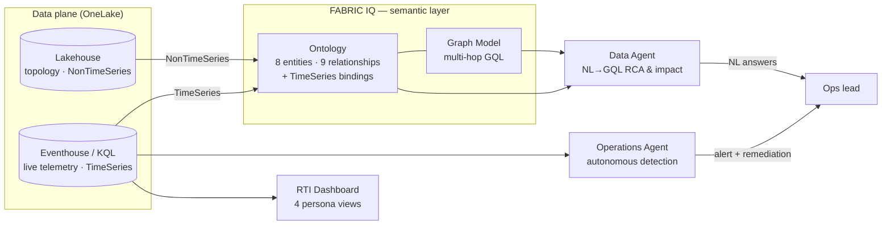

# Architecture — Live Event Operations (LEO)

> **Thesis**: a single **Fabric IQ ontology** (knowledge graph) unifies static topology
> (BIM zones, gates, sessions, sponsors) with **live telemetry** (occupancy, queue wait).
> Fabric agents read/reason over it today; Foundry agents will act on the same ontology tomorrow.

## One ontology, two consumers

## Data model

**Topology → Lakehouse (NonTimeSeries)** — `dim_editions`, `dim_zones` (BIM: surface_m2,
capacity, is_premium), `dim_gates`, `dim_sensors`, `dim_sessions`, `dim_customers` (sponsors),
`dim_sponsorships`, `fact_observations` (Dalux H&S).

**Telemetry → Eventhouse / KQL (TimeSeries)** — `telemetry_kpi` (per zone, long format:
`occupancy_pct`, `people_count`, `density_index`, `utilization_m2_pct`, `comfort_index`),
`telemetry_queue` (per gate: `wait_time_s`, `in_count`, `out_count`), `alarms`, `event_logs`.

### Ontology (8 entities, 9 relationships)
- **Entities**: Edition, Zone, Gate, Sensor, Session, Customer, Sponsorship, Observation.
- **Relationships**: EditionHasZone, ZoneServedByGate, GateAtEdition, GateHasSensor, SessionInZone,
  SessionSponsoredBy, SponsorshipForCustomer, SponsorshipInZone, ObservationInZone.
- **TimeSeries bindings**: Zone→`telemetry_kpi`, Gate→`telemetry_queue` — one ontology unifies
  BIM topology (Lakehouse) + live telemetry (KQL).

## Source mapping (the brief's partner sources)
| Partner source | Feeds |
|---|---|
| Kudelski (badges) | `telemetry_queue` in/out counts |
| XXII / Paradox (computer vision) | `telemetry_kpi` occupancy / density, `telemetry_queue` wait_time |
| Dalux (field observations) | `fact_observations` (H&S / incidents) |
| Programme + plans | `dim_sessions`, `dim_zones`, `dim_gates` |
| BIM (Revit) | `dim_zones` surface_m2 / capacity |

## The storyline (AMGFL26)
Access gate **GATE-05** (serving **Salle Aspen**) hits a **congestion peak** (queue ≈ 25 min).
Aspen saturates (occupancy > 90, density > 4, comfort collapses) during the flagship sessions
**AI for Good / Beauty & AI / Smart City 2030**. Impact traverses Gate → Zone → Session →
Customer, surfacing **3 VIP sponsors** (Northwind Tech, Lumiere Beauty, City of Aurora). This answers the
brief's two demo questions directly.

## Deploy order (strict)
workspace → lakehouse → setup notebook (CSV→Delta) → eventhouse + KQL tables →
preload telemetry → ontology (NonTimeSeries + TimeSeries) → **graph (build + RefreshGraph)** →
kql dashboard (4 persona pages) → data activator → operations agent → data agent.
Single command: `python deploy_all.py`.
